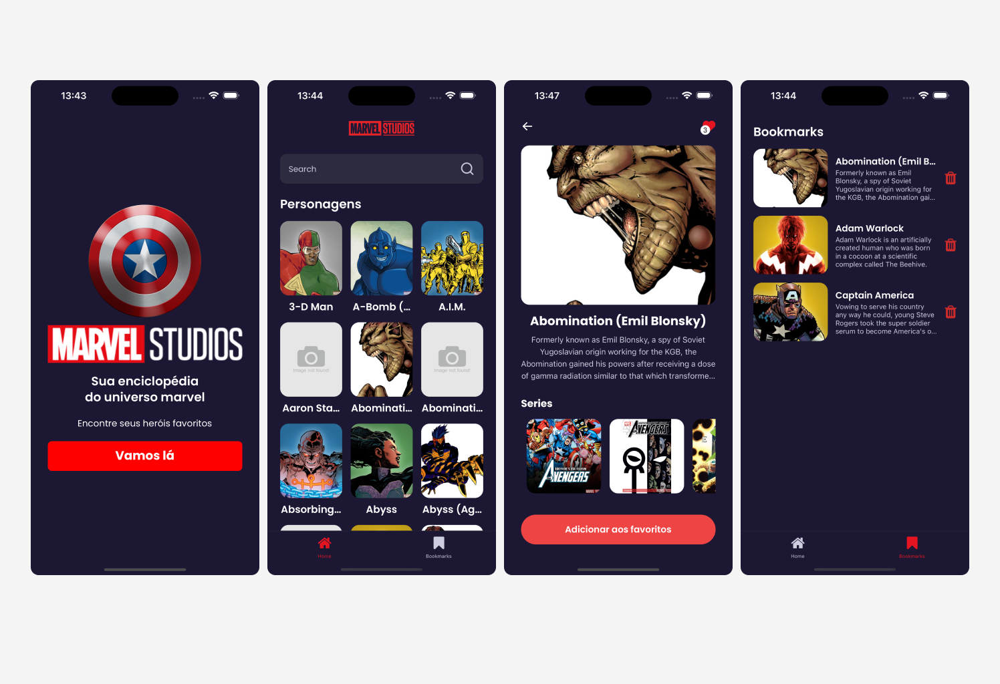

<h1 align="center">
    
</h1>

# Marvel Native

O objetivo dessa aplicação foi colocar em prática alguns conhecimentos de React Native utilizando o ambiente Expo (principalmente expo-router). A aplicação estabelece conexão com a Marvel API e permite ao usuário realizar buscar e favoritar personagens.

## Tech Stack

## Getting Started

1. **Clone project**: `git clone git@github.com:d0ugui/marvel-native.git`
2. **Install dependencies**: `npm install`
3. **Create .env.local using as example .env.example**
4. **Run project**: `npx expo start -c`

## License

This software is available under the following licenses:

- [MIT](https://rem.mit-license.org)
